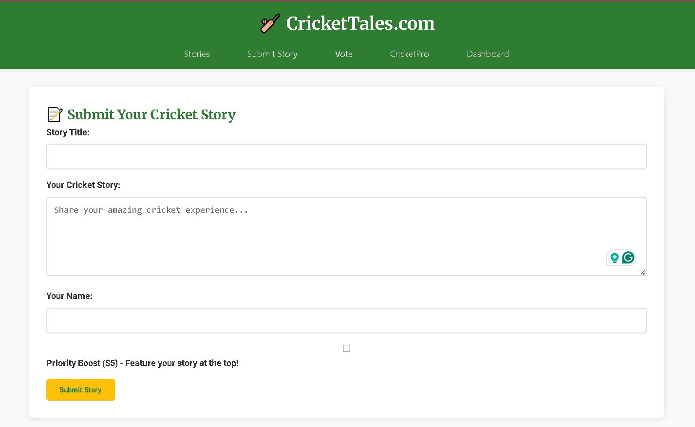
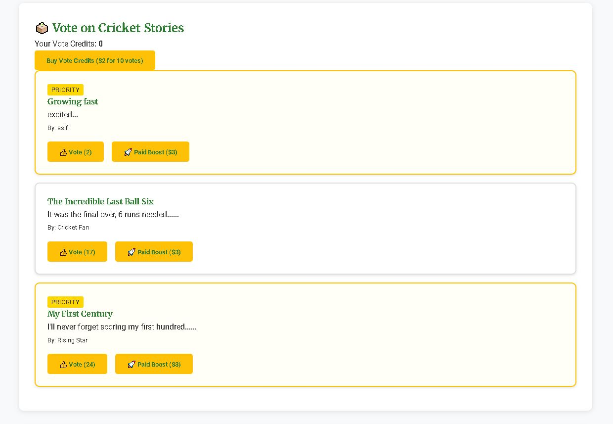
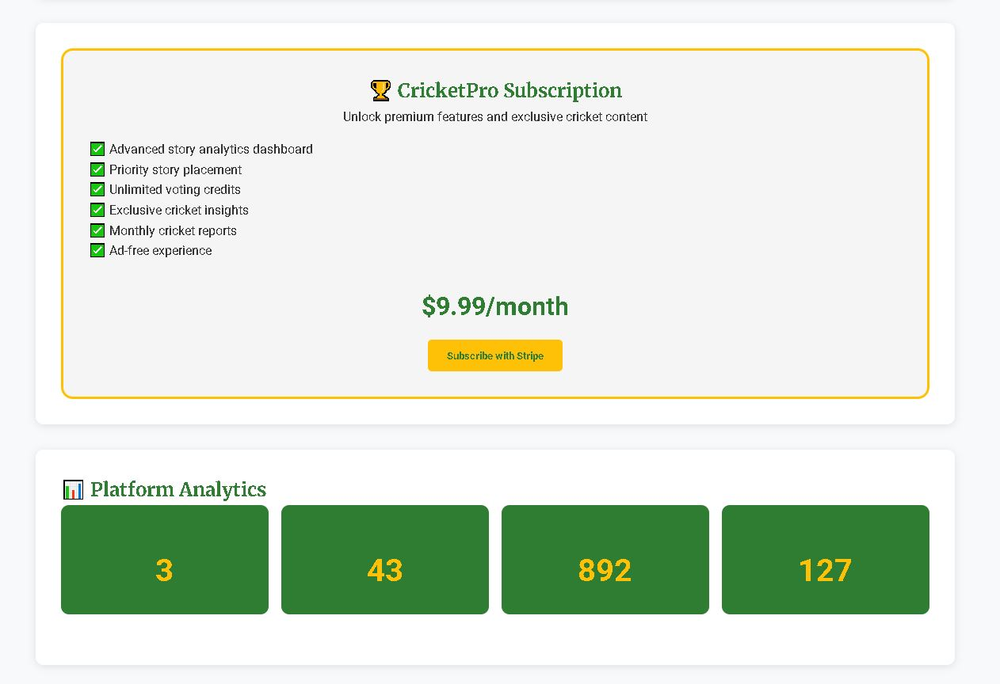

# CricketTales Staging

A unified community-driven platform for sharing and voting on cricket stories, integrating all modules into a single deployable React application. CricketTales allows cricket enthusiasts to share their memorable cricket experiences, vote on their favorite stories, and engage with the cricket community.

## 🏏 Features view




### Core Platform
- **Story Submission**: Share your cricket stories with the community
- **Community Voting**: Vote on your favorite stories with a credit system
- **Story Display**: Browse and read featured cricket stories
- **Story Search & Filtering**: Find stories by category, author, or keywords

### Premium Features
- **Priority Story Submission**: Pay $5 to feature your story prominently
- **Vote Credit Packs**: Purchase additional voting credits
  - Basic Pack: 10 votes for $5
  - Standard Pack: 25 votes for $10
  - Premium Pack: 50 votes for $18
- **Story Boost**: Promote your story for increased visibility
  - 24-hour boost: $10
  - 72-hour boost: $25
  - 7-day boost: $50
- **CricketPro Subscription**: Premium membership with advanced features
  - Monthly Plan: $9.99/month
  - Yearly Plan: $99.99/year (Save 17%)
  - 7-day free trial available
  - Features include:
    - Advanced Analytics Dashboard
    - Unlimited Vote Credits
    - Priority Submissions
    - Exclusive Content Access
    - Enhanced Visibility
    - Performance Metrics

## 🚀 Quick Start

### Prerequisites
- Node.js 18+ 
- npm 8+

### Installation

```bash
# Clone the repository
git clone <(https://github.com/Asif12as/crickettales_staging)>
cd crickettales-staging

# Install dependencies
npm install

# Run development server
npm start
```

### Build for Production

```bash
# Build the application
npm run build

# Start production server
serve -s build
```

### Testing

```bash
# Run tests
npm test
```

## 📁 Project Structure

```
crickettales-staging/
├── api/                    # API endpoints
│   ├── stories.js         # Story listing and management
│   ├── story-submit.js    # Story submission
│   ├── story-vote.js      # Voting functionality
│   ├── boost-status.js    # Story boost management
│   ├── create-boost-session.js # Story boost payment
│   ├── create-priority-session.js # Priority story payment
│   ├── create-vote-pack-session.js # Vote pack purchase
│   ├── pro-trial.js       # CricketPro trial activation
│   └── pro-metrics.js     # Analytics dashboard data
├── public/               # Static assets
│   ├── index.html        # Main HTML file
│   └── js/
│       └── main.js       # Client-side functionality
├── src/                  # React application source
│   ├── components/       # React components
│   │   ├── BoostStory.js # Story boosting functionality
│   │   ├── CricketPro.js # Premium subscription management
│   │   ├── Dashboard.js  # User analytics dashboard
│   │   ├── Home.js       # Homepage component
│   │   ├── Navigation.js # Navigation bar
│   │   ├── Stories.js    # Story listing and filtering
│   │   ├── SubmitStory.js# Story submission form
│   │   └── Vote.js       # Voting functionality
│   ├── App.css          # Main application styles
│   ├── App.js           # Main application component
│   ├── index.css        # Global styles
│   └── index.js         # Application entry point
├── styles/
│   └── main.css          # Additional global styles
├── devansh-module/       # Monetization features module
├── sahil-module/         # Story submission & voting module
├── sujal-module/         # React story submission module
├── varshi-module/        # Core platform features module
├── package.json          # Project dependencies and scripts
└── README.md             # Project documentation
```

## 🎨 Design System

### Brand Colors
- **Primary Green**: #2E7D32
- **Accent Gold**: #FFB300
- **White**: #FFFFFF
- **Light Gray**: #F5F5F5
- **Dark Gray**: #333333

### Typography
- **Headings**: Merriweather
- **Body Text**: Roboto

## 🔧 API Endpoints

### Stories
- `GET /api/stories` - List stories with pagination, filtering, and sorting options
- `POST /api/story-submit` - Submit a new cricket story
- `POST /api/story-vote` - Vote on a story (requires vote credits)

### Monetization
- `POST /api/create-priority-session` - Create payment session for priority story ($5)
- `POST /api/create-vote-pack-session` - Create payment session for vote credit packs
  - Basic Pack: 10 votes for $5
  - Standard Pack: 25 votes for $10
  - Premium Pack: 50 votes for $18
- `POST /api/create-boost-session` - Create payment session for story boost
  - 24-hour boost: $10
  - 72-hour boost: $25
  - 7-day boost: $50
- `GET /api/boost-status` - Get boost status, remaining time, and performance metrics

### CricketPro
- `POST /api/pro-trial` - Activate 7-day CricketPro trial
- `GET /api/pro-metrics` - Get analytics dashboard data for premium users
- `GET /api/dashboard-metrics` - Get user-specific dashboard metrics

## 🚀 Deployment

### Vercel (Recommended)

1. Push code to GitHub repository
2. Connect repository to Vercel
3. Configure build settings: 
   - Build Command: `npm run build`
   - Output Directory: `build`
4. Deploy automatically

### Netlify

1. Push code to GitHub repository
2. Connect repository to Netlify
3. Configure build settings:
   - Build Command: `npm run build`
   - Publish Directory: `build`
4. Deploy automatically

### Manual Deployment

1. Build: `npm run build`
2. Deploy the `build/` directory to your hosting provider
3. Configure server to redirect all routes to `index.html` for client-side routing

## 🔐 Environment Variables

For production deployment, set these environment variables:

```bash
REACT_APP_API_URL=https://api.hosting domain
REACT_APP_STRIPE_PUBLISHABLE_KEY=your_stripe_publishable_key
REACT_APP_SITE_URL=https://your-domain.com
```

For server-side environment variables (if using a separate API server):

```bash
NODE_ENV=production
STRIPE_SECRET_KEY=your_stripe_secret_key
CORS_ORIGIN=https://url
```

## 🧪 Testing

The application includes simulated API responses for testing all features without requiring a backend database.

## 📝 Module Integration

This staging repository successfully integrates multiple modules into a unified React application:

1. **Core Platform (src/)**: Main React application with components for all features
   - Story browsing, submission, and voting
   - User authentication and profile management
   - Navigation and routing

2. **Devansh Module**: Monetization features
   - Priority story submission ($5)
   - Vote credit packs (multiple tiers)
   - Story boost functionality (multiple durations)
   - CricketPro subscription with monthly/yearly plans

3. **Sahil Module**: Core story submission and voting functionality
   - Story submission form and validation
   - Voting mechanism with credit system
   - Story boost implementation

4. **Sujal Module**: Enhanced React-based story submission
   - Rich text editor for story submission
   - Media upload capabilities
   - Form validation and error handling

5. **Varshi Module**: Core platform and featured content
   - Featured stories carousel
   - Story categorization and filtering
   - User engagement features

## 🤝 Contributing

1. Fork the repository
2. Create a feature branch (`git checkout -b feature/amazing-feature`)
3. Make your changes
4. Test thoroughly (`npm test`)
5. Commit your changes (`git commit -m 'Add some amazing feature'`)
6. Push to the branch (`git push origin feature/amazing-feature`)
7. Open a Pull Request

## 📄 License

MIT License - see LICENSE file for details

## 🆘 Support

For issues and questions, please create an issue in the GitHub repository.

---

**Live Demo**: [Coming Soon]
**Repository**: [https://github.com/yourusername/crickettales-staging](https://github.com/yourusername/crickettales-staging)
**Last Updated**: 2025
